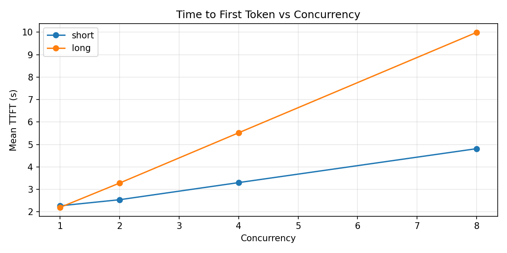
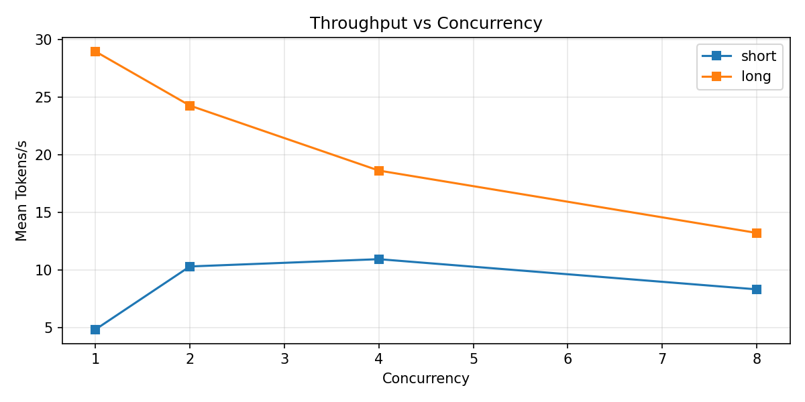
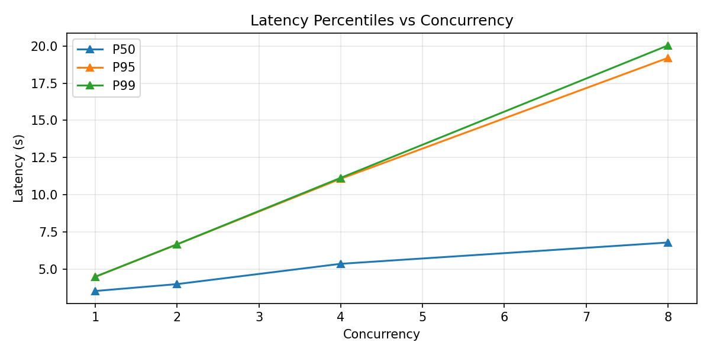

<p align="center">
  
</p>

# LLM Systems & Evals — Mistral-7b on Ollama

> An end-to-end pipeline for serving, evaluating, stress-testing, guardrailing, and improving a locally-hosted open-weights LLM.

[](https://www.python.org/)
[](LICENSE)
[](https://samsaxena.vercel.app/)

---

## Why this exists

Running and evaluating an open-weights LLM end-to-end is a **multi-stage systems problem**, not a single-step one. You need an inference server, a way to talk to it programmatically, a reproducible evaluation harness, latency profiling under concurrency, output guardrails, and a feedback loop to actually improve the model's behaviour. Most tutorials cover one slice. This repo wires all five together for a real model — `mistral:7b` served locally via [Ollama](https://ollama.com/) — with reproducible scripts and committed result artefacts so the numbers are auditable.

It's deliberately CPU-friendly: every result here was produced on a laptop, no GPU required.

---

## What's inside

```
llm-systems-and-evals/
├── serve/        # Inference server bootstrap + demo client (5 scenarios)
├── eval_runner/  # Standardised benchmarks via lm-eval-harness + a custom logical-reasoning task
├── perf/         # Threaded load generator with TTFT / TPOT / P50/95/99 latency analysis
├── guardrails/   # Determinism, schema validation, and stop-sequence enforcement checks
└── improve/      # Prompt-strategy ablations: template, few-shot, CoT, self-consistency
```

| Module | What it does | Headline result |
|---|---|---|
| `serve/` | Boots Ollama, pulls the model, exposes a thin Python client | 5/5 demo scenarios pass |
| `eval_runner/` | Runs HellaSwag, MMLU, and a hand-written logical-reasoning benchmark via `lm-eval-harness` | HellaSwag 40%, MMLU 29.8%, Logical 20% |
| `perf/` | Sweeps concurrency 1→8 across short/long prompts; plots TTFT, TPOT, P95 | TTFT degrades ~linearly under concurrency on Ollama |
| `guardrails/` | Determinism, regex schema, JSON schema, stop-sequence checks | 8/8 pass |
| `improve/` | Five prompt-engineering strategies, ablated independently on HellaSwag | Few-shot **+4.0** points (the only strategy that held a positive delta at n=100) |

---

## Quick start

```bash
# 1. Install dependencies
pip install -r requirements.txt

# 2. Install Ollama (https://ollama.com/download), then in Terminal A:
python serve/serve.py            # starts the server, pulls mistral:7b

# 3. In Terminal B, run any of:
python serve/client.py                                              # 5-scenario demo
python eval_runner/run_eval.py --tasks hellaswag --limit 10         # benchmark
python perf/load_test.py --concurrency 1,2,4,8 --runs 3             # perf sweep
python guardrails/validate.py                                       # guardrail checks
python improve/prepare_data.py --task hellaswag                     # one-off data prep
python improve/infer.py --task hellaswag --strategy few_shot --limit 100
```

A `Makefile` wraps the common targets: `make serve`, `make eval-quick`, `make perf`, `make guardrails`, `make improve`.

> **Note:** `improve/data/` (HellaSwag dump + TF-IDF index, ~78 MB) is gitignored and regenerated by `improve/prepare_data.py` on first run.

---

## Results

### Standardised benchmarks

Sample sizes were chosen for CPU-feasible runtimes; full configs and raw outputs live in `eval_runner/results/`.

| Benchmark         | Accuracy | Sample size | Wall time |
|-------------------|----------|-------------|-----------|
| HellaSwag         | 40.0%    | 10          | 105 s     |
| MMLU (aggregate)  | 29.8%    | 1 / subject | 970 s     |
| Logical Reasoning | 20.0%    | 15 (full)   | 324 s     |

These numbers sit below the published Mistral-7b benchmarks (~60% HellaSwag, ~55% MMLU). The gap is **architectural, not accidental**: `lm-eval-harness` natively scores via per-token log-likelihoods (a closed-form ranking over candidate completions), but the Ollama HTTP API only exposes generative endpoints, so this wrapper scores via free-text generation + regex answer extraction. Generative scoring loses signal whenever the model's intent and the extractor's grammar don't agree. See [`eval_runner/`](eval_runner/) for the full rationale.

### Performance under concurrency

96 requests across concurrency levels {1, 2, 4, 8} × prompt lengths {short, long}.

| Concurrency | TTFT (short) | TTFT (long) | P95 latency (short / long) |
|-------------|--------------|-------------|----------------------------|
| 1           | 2.27 s       | 2.20 s      | 2.40 s / 4.47 s            |
| 2           | 2.55 s       | 3.34 s      | 3.44 s / 6.66 s            |
| 4           | 3.12 s       | 5.29 s      | 5.48 s / 11.08 s           |
| 8           | 4.17 s       | 9.94 s      | 8.58 s / 20.01 s           |

**Headline finding:** TTFT degrades approximately linearly with concurrency because Ollama serialises generation. For latency-sensitive workloads, keep concurrency ≤ 2.

<p align="center">
  
  
</p>
<p align="center">
  
</p>

### Guardrails

8 / 8 checks pass: determinism (3/3), schema validation (3/3), stop-sequence enforcement (2/2). Full report: [`guardrails/report.json`](guardrails/report.json). Notes on residual sources of nondeterminism (KV-cache state, batching, quantisation rounding) are in [`guardrails/README.md`](guardrails/README.md).

### Prompt-strategy ablation (HellaSwag, n=100)

| Strategy                  | Baseline | Optimised | Δ        | Cost vs baseline |
|---------------------------|----------|-----------|----------|------------------|
| Template rewriting        | 61.0%    | 59.0%     | −2.0     | 1.0×             |
| Few-shot (TF-IDF, k=5)    | 59.0%    | 63.0%     | **+4.0** | ~1.3×            |
| Chain-of-thought          | 59.0%    | 58.0%     | −1.0     | ~2.5×            |
| Self-consistency (k=5)\*  | 45.0%    | 60.0%     | +15.0\*  | ~5.0×            |

\* Self-consistency was scored on n=20 due to its 5× generation cost; the delta is expected to compress at full sample size. Full writeup with before/after examples: [`improve/report.md`](improve/report.md).

---

## Engineering notes

A few observations from building this that are worth surfacing, both for anyone reproducing the work and for future-me.

### lm-eval-harness wiring

The cleanest-looking integration path — registering the Ollama wrapper as a Python entry point in `pyproject.toml` so `lm-eval` auto-discovers it — does not work. `lm-eval` does not implement entry-point-based plugin discovery (there's an open issue requesting it). The working pattern is much simpler: `import model as _register_ollama` at the top of the runner script triggers the `@register_model("ollama")` decorator before `simple_evaluate()` is called. No `pip install -e`, no plugin wiring.

Two related sharp edges worth documenting:

1. **`TaskManager.include_path` is a constructor argument, not a method.** `TaskManager(include_path=CUSTOM_TASKS_DIR)` is correct; `task_manager.include_path(path)` silently does nothing useful.
2. **Custom-task YAML paths are resolved relative to CWD, not the YAML file.** Use absolute paths in `data_files`, and explicitly set `split: test` — the HuggingFace JSON loader defaults to creating a `train` split, which lm-eval then refuses with `must have valid or test docs!`.

### Why prompt strategies under-deliver on a 7B Q4 model

The most interesting finding is also the least flattering one for the prompt-engineering literature. Across every strategy in `improve/`, the optimised prompt starts strong (often +15 to +20 points at n=20) and then the delta erodes as the sample grows — sometimes going negative by n=100. CoT in particular ends at −1.0.

The working hypothesis: at 7B parameters with Q4_0 quantisation, the model's effective working capacity is small enough that the prompt scaffold itself competes with the question for attention. Few-shot — which encodes task format as concrete (passage, choices, answer) triples — survives this because the information is direct rather than meta. CoT, which asks the model to *generate* a reasoning chain, expects capacity the model doesn't reliably have at this size and quantisation. Self-consistency genuinely reduces variance via majority vote, but it costs 5× compute and most of the gain still compresses at scale.

The practical takeaway: published prompt-engineering wins from the GPT-3.5/4 era don't transfer cleanly downwards. On smaller open-weights models, the cheapest, most directly informative prompt usually wins.

### Notebook gotcha worth memorialising

`metrics.csv` records empty strings in the `error` column for successful requests. Pandas reads empty CSV cells as `NaN`, not `""`, so `df[df["error"] == ""]` filters every row out and silently produces a blank notebook. The fix is `df[df["error"].isna() | (df["error"] == "")]`. The plots only made sense once this was corrected.

---

## About

Built by **Samarth Saxena** — AI/ML Engineer with an interest in LLM systems, evaluation, and the messy infrastructure between a model checkpoint and a working product.

[Portfolio](https://samsaxena.vercel.app/) · [GitHub](https://github.com/samarth1337) · [LinkedIn](https://www.linkedin.com/in/samarth-saxena-/)

Released under the [MIT License](LICENSE). Issues and PRs welcome. Some parts of this README were written by Gemini (Quickstart, What's inside).
